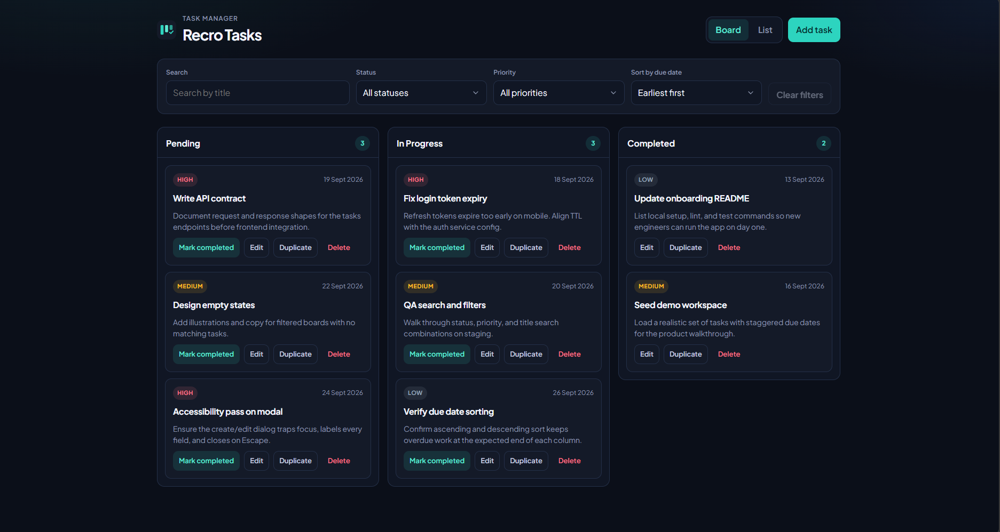
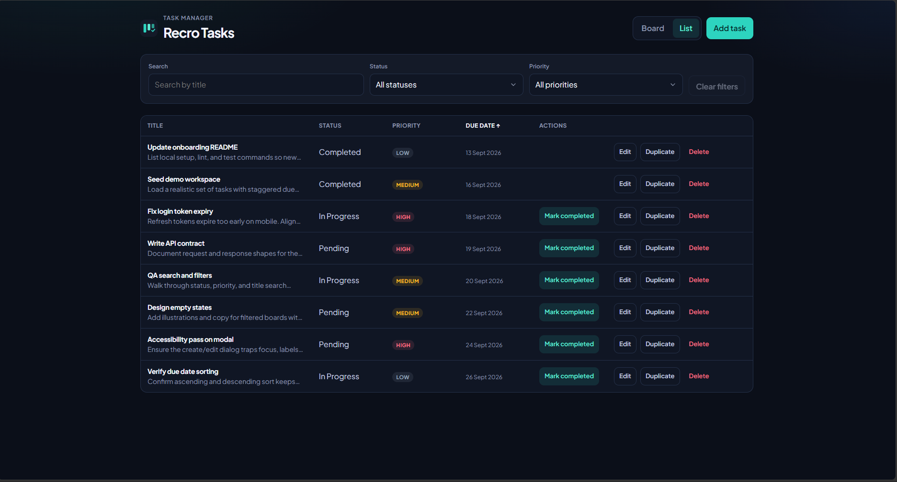
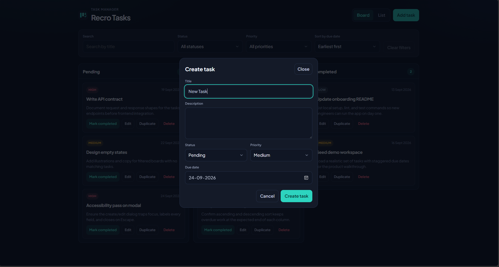

# Recro Tasks

A dark-themed task board for creating, editing, completing, and filtering work across Pending, In Progress, and Completed columns.

## Screenshots

### Board view

Kanban layout with Pending, In Progress, and Completed columns. Search, status, priority, and due-date sort sit above the board. Each card shows priority, due date, and actions (complete, edit, duplicate, delete).



### List view

The same filtered tasks in a compact table. Click Title, Status, Priority, or Due date to sort. Incomplete rows keep a Mark completed action; completed rows do not.



### Create / edit task

Modal for adding or updating a task. Title is required; description, status, priority, and due date can be set before saving.



## Features

- Create and edit tasks with title, description, status, priority, and due date
- Title is required before a task can be saved
- Delete a task, with confirmation
- Mark a task as completed
- Search by title
- Filter by status and priority (filters combine)
- Sort by due date, earliest or latest first
- Empty state when nothing matches the current filters
- Tasks persist in `localStorage` after a browser refresh
- Seeded with realistic demo tasks on first load

## Stack

- React 19 + TypeScript
- Vite
- ESLint (import order + grouping)
- Vitest + Testing Library
- Husky + lint-staged (lint staged files before each commit)

## Setup

```bash
npm install
npm run dev
```

Open the local URL printed by Vite (usually `http://localhost:5173`).

### Other commands

```bash
npm run lint        # ESLint
npm run test        # Vitest, single run
npm run test:watch  # Vitest, watch mode
npm run build       # production build
npm run preview     # preview the production build
```

## Persistence

Tasks are saved to `localStorage` under the `recro-tasks` key. Clearing site data (or that key) restores the demo board on the next load.

## Project structure

```text
src/
  App.tsx                 # board shell, filters, modal wiring
  components/             # columns, cards, filters, modal, empty state
  constants.ts            # status and priority values
  data/demoTasks.ts       # initial dummy tasks
  hooks/useTaskStore.ts   # CRUD + localStorage
  types.ts
  utils/tasks.ts          # filter, sort, validate, serialize
public/
  favicon.svg
  apple-touch-icon.png
```

## CI

GitHub Actions run two workflows on `main`:

- Lint
- Test
